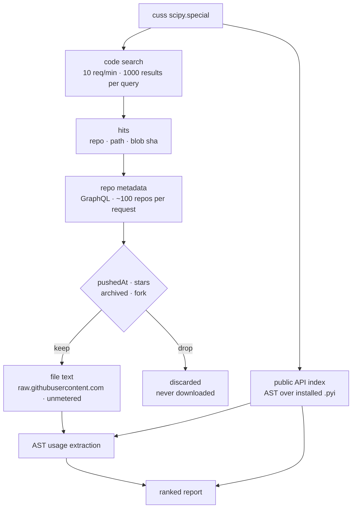
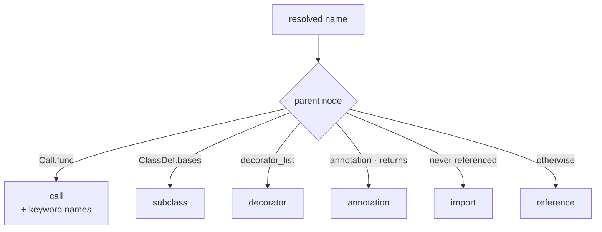

# cuss: code usage statistics

> [!WARNING]
> This is a vibe-coded project. Every line of it was written by an LLM, including this
> warning. It is linted, typed and tested, none of which is evidence that it is correct.
> Read the code before trusting a number it gives you — especially before deleting
> anything on its advice.

Which public symbols of a Python package does the world actually use, and how?

Answers two questions:

- Can I deprecate `X`?
- Which symbols should I improve first?

## Usage

```shell
cuss scipy.special --since 2y --min-stars 50 --keywords
```

```
scipy.special — 400 files, 289 repos, pushed >= 2y

symbol         refs  files  repos  call  ref  import  keywords
softmax          77     43     41    72    3       2  axis 46
erf              73     33     33    63    1       9
gamma           136     32     30   130    3       3
logsumexp        95     24     22    92            3  axis 49, keepdims 11, a 1, b 1
comb             45     18     17    44            1  exact 6, repetition 2

549 public symbols unused (--unused)
```

One column per usage kind, and only for the kinds that occur — `httpx` gets `subcls` and
`annot` columns that `scipy.special` has no use for. Names are relative to the scope in
the header line.

The target is a module, a symbol, a distribution, a directory, or a file:

```shell
cuss scipy.special             # rank one module
cuss scipy.special.gamma       # one symbol
cuss scipy-stubs --unused      # deprecation candidates across the package
cuss ./scipy-stubs/special     # a working tree, scoped to a submodule
cuss ./src/mypkg/_core.py      # whichever file is open
```

Dotted targets are resolved from `sys.path`. Paths climb to the top-level package —
a parent holding `__init__` means there is more package above — so pointing anywhere
inside a checkout works, and the position within it becomes the scope.

Needs `GITHUB_TOKEN`, `GH_TOKEN`, or an authenticated `gh`.

## How it works

Code search finds the corpus. AST analysis measures it.



Results are cached: blobs by their immutable blob sha, search pages and repo metadata
with a TTL. `--refresh` ignores the cache.

## Why not count search hits?

One query per symbol is the obvious design. It does not work.

| Measured                                             | Consequence                                    |
| ---------------------------------------------------- | ---------------------------------------------- |
| `/search/code` allows 10 requests per minute         | 3136 public symbols in `scipy-stubs` ≈ 5 hours |
| No regex, no `OR`, no parentheses, no `path:` glob   | Cannot express "this symbol, qualified"        |
| Only the first 1000 results of a query are reachable | Counts are truncated anyway                    |
| Date qualifiers are silently ignored                 | Cannot ask for code that is still alive        |

So search runs a handful of queries to *find files*, and the AST *counts symbols*. Budget
is spent per page, not per symbol. Age and popularity filtering happens afterwards, over
repository metadata, which is where those qualifiers actually exist.

## What gets counted

Every import form is resolved to a qualified name:

| Source                                 | Resolves to                                |
| -------------------------------------- | ------------------------------------------ |
| `import scipy.special`                 | `scipy.special.gamma` via the dotted chain |
| `import scipy.special as sp`           | `sp.gamma`                                 |
| `from scipy import special`            | `special.gamma`                            |
| `from scipy.special import gamma as g` | `g`                                        |
| `from scipy.special import *`          | bare `gamma`, against the public API index |

Any name the file binds itself — assignment, parameter, `except ... as`, `match` capture —
shadows the import and is dropped, so a local `def gamma` is never mistaken for the real
one. Resolved names are trimmed to the longest prefix that exists in the API index, so
`gamma(x).shape` counts as `scipy.special.gamma` and unknown attributes count as nothing.

Each reference is classified by where it appears:



Ranking is by distinct repositories first, then raw references — one prolific codebase
should not outvote the ecosystem. Keyword names are collected per call site, which is the
most direct signal for which overloads and parameters need to be right.

## Prior art: python-api-inspect

[Quansight-Labs/python-api-inspect](https://github.com/Quansight-Labs/python-api-inspect)
asks the same question, down to the wording ("Can certain functions be depreciated?"), and
its AST analysis is more thorough than this one. It could not be reused or built upon:

|                           |                                                                           |
| ------------------------- | ------------------------------------------------------------------------- |
| Last commit               | February 2021                                                             |
| Published to PyPI         | No                                                                        |
| Hosted datasette instance | `python-api-inspect.aves.io` no longer resolves                           |
| Shape                     | Nix shell + scripts producing a ~6 GB sqlite database, not a CLI          |
| Corpus                    | Repository lists checked into the repo, pinned to `master` refs from 2021 |
| Refreshing the corpus     | Needs a local sqlite copy of the libraries.io Open Data dump              |

The deeper mismatch is structural. It counts the namespaces it observes and has no index
of a package's *declared* public API, so it cannot report the symbols nobody used — which
is the entire deprecation question. And it reads `.py` and `.ipynb` source, so a stub-only
distribution like `scipy-stubs` has nowhere to fit.

## Limits

- The 1000-result cap and best-match ordering make the corpus a sample, not a census.
  Counts rank; they do not total.
- Best-match ordering is not quality ordering. Without `--min-stars`, expect hallucinated
  imports from vibe-coded repositories to show up as real usage.
- Shadowing is per file, not per scope. A name bound anywhere in a file suppresses that
  import everywhere in it, so counts err low rather than high.
- Public GitHub only.
